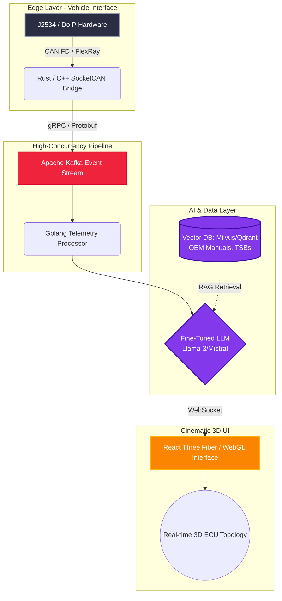

# 🚀 OmniDiag-AI : Enterprise Autonomous Vehicle Diagnostic Ecosystem
**نظام بيئي متكامل لتشخيص وهندسة السيارات مدعوم بالذكاء الاصطناعي الذاتي**

*Engineered by **Faouzi Soufiane** — Chief Systems Engineer | AI Engineer*

 

## 🌐 رؤية المشروع (Enterprise Vision)
تم هندسة **OmniDiag-AI** ليتجاوز مجرد قراءة أكواد الأعطال. هذا المشروع عبارة عن أسطول تنسيق خلفي عالي التزامن (High-Concurrency Backend Orchestration Fleet) مصمم لمعالجة كميات هائلة من بيانات القياس عن بعد (Automotive Telemetry). من خلال دمج **نماذج ذكاء اصطناعي مضبوطة بدقة (Fine-Tuned AI Models)** مع **واجهات ويب ثلاثية الأبعاد سينمائية (Cinematic 3D Web Interfaces)**، يوفر النظام أتمتة كاملة لعزل الأعطال، تحليل الشبكات (Topology)، واقتراح هندسة عكسية للإصلاح.

---

## 🏛️ البنية التحتية وهندسة النظام (System Architecture)

النظام مبني على بنية الخدمات المصغرة (Microservices) لضمان التوسع ومعالجة البيانات في الوقت الفعلي:

---

## 🧠 العقل الذكي (Autonomous AI Agent)
لا يعتمد النظام على استدعاءات API بسيطة، بل يعمل كمحرك تفكير ذاتي (Autonomous Reasoning Engine):
1. **RAG Pipeline & Vector Databases:** تغذية النظام بملايين المستندات الهندسية، مخططات الأسلاك (Wiring Diagrams)، و TSBs.
2. **Fine-Tuning:** ضبط دقيق لنماذج اللغات الكبيرة (LLMs) لفهم بروتوكولات (UDS - Unified Diagnostic Services) وتحويل كتل البيانات السداسية (Hex Dumps) إلى استنتاجات منطقية.
3. **Predictive Analytics:** التنبؤ بالأعطال قبل وقوعها من خلال تحليل انحرافات البيانات الحية (Live Data Anomalies) عبر الزمن.

---

## 🛠️ التقنيات والأدوات المستخدمة (Enterprise Tech Stack)

### 🏎️ Edge & Hardware Integration
* **Rust & C++:** للتعامل مع بروتوكولات الطبقة المنخفضة (Low-level SocketCAN, J2534 Pass-Thru, K-Line).
* **Hardware:** واجهات متقدمة تدعم **CAN FD** و **DoIP** (Diagnostics over Internet Protocol).

### ⚙️ Backend Orchestration & Data Streaming
* **Golang & Node.js:** بناء خدمات مصغرة عالية الأداء والتزامن.
* **Apache Kafka / RabbitMQ:** تدفق الأحداث (Event Streaming) والقياس عن بعد.
* **gRPC / WebSockets:** اتصال ثنائي الاتجاه منخفض الكمون (Low-latency).
* **Kubernetes (K8s) & Docker:** أتمتة النشر وإدارة الحاويات.

### 🧠 AI & Machine Learning
* **PyTorch & HuggingFace:** تدريب وضبط النماذج (Fine-Tuning).
* **Milvus / Qdrant:** قواعد بيانات متجهية (Vector Databases) لمعالجة البيانات الضخمة.
* **LangChain / LlamaIndex:** لبناء أطر وكلاء الذكاء الاصطناعي (AI Agents).

### 🌌 Cinematic 3D Frontend
* **React / Next.js:** بنية الواجهة الأساسية.
* **Three.js & React Three Fiber:** بناء بيئات تفاعلية ثلاثية الأبعاد (3D Topology Maps) تعكس حالة وحدات التحكم (ECUs) بتأثيرات بصرية سينمائية.

---

## 🚙 التغطية الهندسية (Supported Ecosystems)
نظامنا مصمم للتكامل مع أعقد البنيات التحتية للسيارات الحديثة:
* **الألمانية (German Engineering):** دعم كامل لبروتوكولات DoIP لسيارات (Mercedes-Benz, BMW, VAG Group).
* **السيارات الكهربائية (EVs):** تحليل متقدم لوحدات إدارة البطاريات (BMS) وبنيات الفولطية العالية.
* **البنية التحتية للشبكات:** تحليل عقد CAN FD، FlexRay، و Automotive Ethernet.

---

   
  <h3> <i>Built with ❤️ — Learning never stops.</i> </h3>

